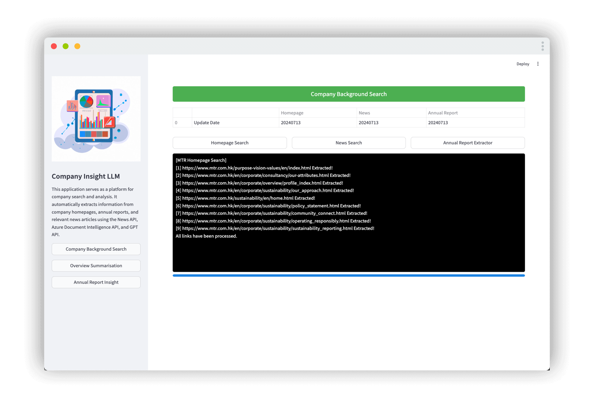
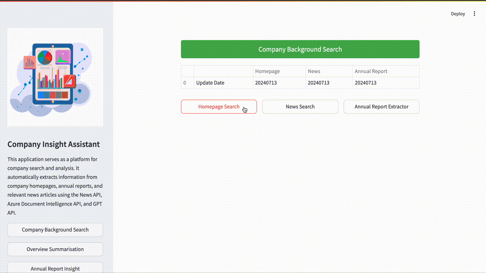
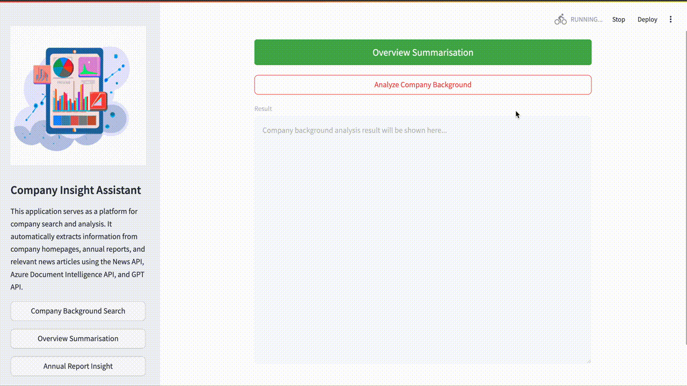
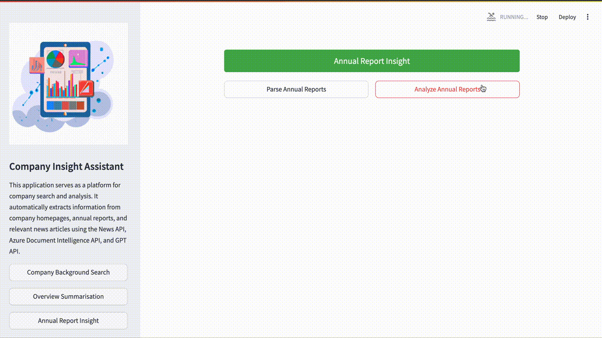

<!-- HEADER -->
<a id="readme-top"></a>

<br />
<div align="center">
  <a href="https://github.com/vinc1am/company-insight-llm">
    
  </a>

  <h3 align="center">Company Insight Assistant</h3>

  <p align="center">
    Quick Company Analysis through Examination of Webpages, News, and Annual Reports
    <br />
  </p>

  [![MIT License][license-shield]][license-url]
  [![LinkedIn][linkedin-shield]][linkedin-url]
  [![Website][website-shield]][website-url]

</div>

<details>
  <summary>Table of Contents</summary>
  <ol>
    <li><a href="#about-the-project">Overview</a></li>
    <li><a href="#getting-started">Installation</a></li>
    <li><a href="#usage">Usage</a></li>
    <li><a href="#roadmap">Roadmap</a></li>
    <li><a href="#license">License</a></li>
    <li><a href="#acknowledgments">Acknowledgments</a></li>
  </ol>
</details>


<!-- Overview -->
## Overview



Company Insight Assistant is a simple application designed to swiftly analyze company backgrounds by examining and analyzing webpages, news articles, and annual reports. It leverages Azure Document Intelligence, OpenAI GPT, and the News API to perform these tasks efficiently.

**Key Features Include:**

* Extract the information from **Homepage**, the latest **Annual Report**, and relevant **News** using the News API.
* Use **Azure OpenAI GPT** to summarize the company overview based on the homepage information and relevant news.
* Extract the **Key figures & Insights** with financial calculations from the annual report.


For demonstration purposes, the application extracts information from MTR's homepage, the latest MTR Annual Report, and relevant news articles using the News API. Azure OpenAI GPT is utilized to summarize the company overview based on homepage information and relevant news. Additionally, key figures and insights are extracted from the annual report through financial calculations.

To get started with the application, execute `streamlit run app.py`.


<!-- GETTING STARTED -->
## Getting Started

Here are the instructions on setting up the project locally. To get a local copy up and running, please follow these steps:

### Installation

1. Register and Obtain API Keys:
   - **News API**: Sign up at [News API](https://newsapi.org) to get your API key.
   - **Azure Document Intelligence API**: Sign up at [Azure](https://azure.microsoft.com) to get your API key and endpoint.
   - **Azure OpenAI Service**: Sign up at [Azure](https://azure.microsoft.com) to get your API key, endpoint, engine name, API type, and version.

2. Clone the repo
   ```sh
   git clone https://github.com/vinc1am/company-insight-llm.git
   ```
3. Rename .env.template as .env. Fill in the parameters
   ```sh
    NEWS_API_KEY=<your news api key>
    AZURE_DI_API_KEY=<your azure document intelligent api key>
    AZURE_DI_ENDPOINT=<your azure document intelligent endpoint>
    AZURE_GPT_ENGINE=<your azure openai engine name>
    AZURE_GPT_API_BASE=<your azure openai api base>
    AZURE_GPT_API_TYPE=<your azure openai api type>
    AZURE_GPT_API_VERSION=<your azure openai api version>
    AZURE_GPT_API_KEY=<your azure openai api key>
   ```
4. Go to your project folder and install the required Python packages
   ```sh
   pip install -r requirements.txt
   ```
5. Run the application
   ```sh
   streamlit run app.py
   ```


<!-- USAGE EXAMPLES -->
## Usage

### Company Background Search
Search for information from the company's webpage and the latest annual report. Use the News API to find the latest news related to the company.



### Overview Summarization

Use Azure OpenAI GPT to summarize the information extracted from the company's webpage and the news. Condense the information into a short overview.



### Annual Report Insight
Use Document Intelligence to parse the annual report and Azure OpenAI GPT to extract key figures from financial statements. Uncover insights from the statements.




<!-- ROADMAP -->
## Roadmap

- [x] Web Scrapping functions to extract the content, news and annual report
- [x] Prompt to summarise the content and analyse the annual report
- [x] User Interface


<!-- LICENSE -->
## License

Distributed under the MIT License. See `LICENSE.txt` for more information.


<!-- ACKNOWLEDGMENTS -->
## Acknowledgments

This project would not have been possible without the valuable resources and insights derived from the following sources:

* [MTR HK](https://www.mtr.com.hk/)
* [News API](https://newsapi.org)
* [Streamlit](https://streamlit.io)

<p align="right" style="font-family:verdana;font-size:80%;color:blue"><b><a href="#readme-top" >Back to Top</a></b></p>


<!-- MARKDOWN LINKS & IMAGES -->
[license-shield]: https://img.shields.io/badge/License-MIT-yellow.svg
[license-url]: https://opensource.org/licenses/MIT
[website-shield]: https://img.shields.io/badge/Website-blue.svg
[website-url]: https://www.vinc1am.com/gallery.html#featured
[linkedin-shield]: https://img.shields.io/badge/LinkedIn-blue.svg
[linkedin-url]: https://www.linkedin.com/in/vinc1am/

